# ⚡️ TENSION : Kinetic Typography Engine

> **"정적인 텍스트를 살아있는 유기체로 — 감정과 긴장감을 시각·청각으로 시각화하는 인터랙티브 키네틱 엔진"**  
> ⏱️ **AI-Native 워크플로우 기반 4시간 집중 프로토타이핑 프로젝트**

---

## 📌 Project Overview

* **프로젝트명**: TENSION (텐션)
* **개발 소요 시간**: 4시간 이내 (AI-Native 고속 페어 프로그래밍)
* **개발 포지션**: 프론트엔드 인터랙티브 엔지니어링 / 크리에이티브 코딩
* **기술 스택**: `Next.js 16 (App Router)`, `React 19`, `TypeScript`, `Framer Motion`, `Web Audio API`, `Tailwind CSS`
* **저장소**: [https://github.com/yshls/tension](https://github.com/yshls/tension)

---

## 💡 Concept & Philosophy

기존의 텍스트 입력기는 글자를 단순히 '입력된 기호'로만 다룹니다.  
**`TENSION`**은 사용자가 키보드를 두드릴 때 발생하는 **'리듬'과 '긴장감(Tension)'**에 주목하여, 글자 하나하나가 마치 살아있는 생명체처럼 유기적으로 반응하는 **차세대 인터랙티브 타이포그래피 경험**을 제공합니다.

---

## ✨ Key Features

### 1. 🧬 자율 신경 모션 시스템 (Autonomous Motion System)
* **고유 시드(Seed) 부여**: 각 글자의 ASCII 코드를 기반으로 개별 글자마다 고유한 성격(`timid`, `rebel`, `drunk`, `chill`)과 글리치 프로필을 자동 생성
* **유기적 모션 연산**: 심장 박동(`Pulse`)과 유영(`Drift`) 물리 공식을 `requestAnimationFrame`과 Framer Motion `useSpring`으로 실시간 연산 (60FPS 보장)

### 2. ⚡️ 실시간 긴장도 상태 관리 (Tension Context & Decay)
* **긴장도 축적**: 타이핑 빈도와 마우스 움직임에 따라 긴장 수치(`0.0 ~ 1.0`)가 실시간 누적
* **다감각 시각 피드백**:
  * 긴장도 비례 배경색 전환 (`#F0F0F0` 쿨 그레이 → `#1a0505` 딥 크림슨)
  * 비네팅(Vignette) 수축 효과
  * 폰트 두께(`wght`) 및 미세 떨림(`Jitter`) 증폭
  * RGB 분리 효과(Chromatic Aberration) 및 와이어프레임 모드 전환
* **자연 감쇄(Decay)**: 입력을 멈추면 인터벌 타이머를 통해 긴장도가 서서히 자연 해소

### 3. 🔊 제로 에셋 실시간 신시사이저 (Web Audio API)
* **외부 음원 파일 제로**: 무거운 `.mp3` 에셋 없이 브라우저 내장 Web Audio API(`OscillatorNode`, `GainNode`, `BiquadFilterNode`)로 실시간 주파수 합성
* **반응형 피치 모듈레이션**: 타이핑 시 긴장도 수치에 비례하여 메인 사인파 주파수(150Hz~350Hz) 및 공명음 실시간 변조
* **폭발 초기화 사운드**: <kbd>Enter</kbd> 입력 시 서브 베이스 킥(Sub-bass Kick)과 고음 파열 노이즈(Shatter Noise)가 결합된 다이내믹 사운드 출력

### 4. ⌨️ 브라우저 입력 최적화 & IME 예외 처리
* **단일 행 입력창 및 이벤트 인터셉트**: 브라우저 포커스 정책과 한글 IME 환경에서 줄바꿈이 일어나는 문제를 `<input type="text">`와 전역 키보드 인터셉터로 원천 차단
* **고대비 HUD 가이드 바**: `position: fixed`, `zIndex: 9999` 다크 글래스모피즘 스타일로 화면 상단에 100% 뚜렷한 조작 안내 제공

### 5. 🎨 10종 다국어 가변 폰트(Variable Fonts)
* Next.js 폰트 최적화 시스템(`next/font/google`)을 통해 영문 5종(`Syne`, `Anton`, `Space Grotesk`, `Abril Fatface`, `Bebas Neue`)과 한글 5종(`검은고딕`, `도현`, `송명`, `함렛`, `고운돋움`)을 CSS 변수로 유기적 바인딩

---

## ⏱️ AI-Native 4시간 고속 개발 워크플로우

본 프로젝트는 **"AI 도구를 아키텍처 고속 프로토타이핑 파트너로 활용하여 개발 생산성을 극대화하는 엔지니어링 역량"**을 실증하기 위해 진행되었습니다.

```mermaid
gantt
    title TENSION 4시간 개발 타임라인
    dateFormat  HH:mm
    axisFormat %H:%M
    section Phase 1 (1h)
    인터랙션 기획 및 아키텍처 설계        :00:00, 1h
    section Phase 2 (1.5h)
    Web Audio 주파수 합성 & 물리 모션 엔진 :01:00, 1.5h
    section Phase 3 (1h)
    IME 줄바꿈 디버깅 & Turbopack 최적화   :02:30, 1h
    section Phase 4 (0.5h)
    고대비 HUD 바 & 빌드 검증 및 깃허브 배포 :03:30, 0.5h
```



| 시간 | 단계 | 주요 작업 내용 |
| :--- | :--- | :--- |
| **00:00 ~ 01:00** | **기획 및 구조 설계** | Next.js 16 + React 19 환경 구성, Tension 전역 Context 상태 모델링, 10종 폰트 시스템 구축 |
| **01:00 ~ 02:30** | **물리 & 오디오 엔진 개발** | `requestAnimationFrame` 자율 신경 모션 구현, Web Audio 발진기 기반 실시간 피치 변조 합성 |
| **02:30 ~ 03:30** | **심층 디버깅 & 최적화** | 다중 lockfile로 인한 Turbopack 루트 인식 문제 해결, 한글 IME 환경의 Enter 줄바꿈 원천 차단 |
| **03:30 ~ 04:00** | **UI 폴리싱 & 프로덕션 검증** | 고대비 글래스모피즘 HUD 바 추가, .gitignore 보안 규칙 강화, 정적 빌드 테스트 및 배포 |

---

## 🛠️ Tech Stack & Architecture

```text
src/
├── app/
│   ├── fonts.ts          # 한글/영문 10종 폰트 변수 정의 및 최적화
│   ├── globals.css       # 테마 토큰 및 플래시 애니메이션 정의
│   ├── layout.tsx        # 메타데이터, 파비콘, 폰트 주입 및 Provider 래핑
│   └── page.tsx          # 메인 키네틱 캔버스, 전역 키보드 이벤트, HUD 가이드
├── components/
│   ├── ElasticLetter.tsx  # 글자별 물리 스프링, 글리치, RGB 분리 연산 컴포넌트
│   └── SentenceBuilder.tsx # 단어/문장 단위 레이아웃 및 캐럿 커서 렌더러
├── context/
│   └── TensionContext.tsx # 긴장도 상태 누적, 자연 감쇄, 폭발 트리거 관리
└── hooks/
    └── useElasticAudio.ts # Web Audio API 오실레이터 합성 및 노이즈 생성 훅
```

---

## 🚀 Getting Started

### 1. Repository Clone
```bash
git clone https://github.com/yshls/tension.git
cd tension
```

### 2. Dependency Installation
```bash
npm install
```

### 3. Development Server Run
```bash
npm run dev
```
브라우저에서 [http://localhost:3000](http://localhost:3000)으로 접속하여 인터랙션을 경험할 수 있습니다.

---

## 📜 License
MIT License © 2026 [yshls](https://github.com/yshls)
