# TENSION : Kinetic Typography Engine

> **정적인 텍스트를 살아있는 유기체로 — 감정과 긴장감을 시각·청각으로 시각화하는 인터랙티브 키네틱 엔진**  
> AI-Native 워크플로우 기반 4시간 집중 프로토타이핑 프로젝트

---

## 1. Project Overview

* **프로젝트명**: TENSION
* **배포 주소**: [https://yshls.github.io/tension](https://yshls.github.io/tension)
* **개발 소요 시간**: 4시간 이내
* **포지션**: 프론트엔드 인터랙티브 엔지니어링 / 크리에이티브 코딩
* **기술 스택**: Next.js 16, React 19, TypeScript, Framer Motion, Web Audio API, Tailwind CSS

---

## 2. Concept & Philosophy

기존의 텍스트 입력기는 글자를 단순히 입력된 기호로만 다룹니다.  
**TENSION**은 사용자가 키보드를 두드릴 때 발생하는 **리듬과 긴장감**에 주목하여, 글자 하나하나가 마치 살아있는 생명체처럼 유기적으로 반응하는 **차세대 인터랙티브 타이포그래피 경험**을 제공합니다.

---

## 3. Key Features

### 자율 신경 모션 시스템
* **고유 시드 부여**: 각 글자의 ASCII 코드를 기반으로 개별 글자마다 고유한 성격과 글리치 프로필을 자동 생성
* **유기적 모션 연산**: 심장 박동과 유영 물리 공식을 `requestAnimationFrame`과 Framer Motion `useSpring`으로 실시간 연산하여 60FPS 모션 보장

### 실시간 긴장도 상태 관리
* **긴장도 축적**: 타이핑 빈도와 마우스 움직임에 따라 긴장 수치가 실시간 누적
* **다감각 시각 피드백**:
  * 긴장도 비례 배경색 전환: 쿨 그레이에서 딥 크림슨으로 실시간 보간
  * 비네팅 시야 수축 효과
  * 폰트 두께 및 미세 떨림 증폭
  * RGB 분리 효과 및 와이어프레임 모드 전환
* **자연 감쇄**: 입력을 멈추면 인터벌 타이머를 통해 긴장도가 서서히 자연 해소

### 제로 에셋 실시간 신시사이저
* **외부 음원 파일 제로**: 별도의 오디오 파일 없이 브라우저 내장 Web Audio API 발진기로 실시간 주파수 합성
* **반응형 피치 모듈레이션**: 타이핑 시 긴장도 수치에 비례하여 메인 사인파 주파수 및 공명음 실시간 변조
* **폭발 초기화 사운드**: Enter 입력 시 서브 베이스 킥과 고음 파열 노이즈가 결합된 다이내믹 사운드 출력

### 브라우저 입력 최적화 및 IME 예외 처리
* **단일 행 입력창 및 이벤트 인터셉트**: 브라우저 포커스 정책과 한글 IME 환경에서 줄바꿈이 일어나는 문제를 `<input type="text">`와 전역 키보드 인터셉터로 원천 차단
* **고대비 HUD 가이드 바**: 다크 글래스모피즘 스타일로 화면 상단에 명확한 조작 안내 제공

### 10종 다국어 가변 폰트
* Next.js 폰트 최적화 시스템을 통해 영문 5종과 한글 5종(검은고딕, 도현, 송명, 함렛, 고운돋움)을 CSS 변수로 유기적 바인딩

---

## 4. AI-Native 4시간 고속 개발 워크플로우

본 프로젝트는 **AI 도구를 아키텍처 고속 프로토타이핑 파트너로 활용하여 개발 생산성을 극대화하는 엔지니어링 역량**을 실증하기 위해 진행되었습니다.

```mermaid
gantt
    title TENSION 4시간 개발 타임라인
    dateFormat  HH:mm
    axisFormat %H:%M
    section Phase 1
    인터랙션 기획 및 아키텍처 설계        :00:00, 1h
    section Phase 2
    Web Audio 주파수 합성 및 물리 모션 엔진 :01:00, 1.5h
    section Phase 3
    IME 줄바꿈 디버깅 및 Turbopack 최적화   :02:30, 1h
    section Phase 4
    고대비 HUD 바 및 빌드 검증과 배포       :03:30, 0.5h
```



| 시간 | 단계 | 주요 작업 내용 |
| :--- | :--- | :--- |
| **00:00 ~ 01:00** | **기획 및 구조 설계** | Next.js 16 + React 19 환경 구성, Tension 전역 Context 상태 모델링, 10종 폰트 시스템 구축 |
| **01:00 ~ 02:30** | **물리 및 오디오 엔진 개발** | `requestAnimationFrame` 자율 신경 모션 구현, Web Audio 발진기 기반 실시간 피치 변조 합성 |
| **02:30 ~ 03:30** | **심층 디버깅 및 최적화** | 다중 lockfile로 인한 Turbopack 루트 인식 문제 해결, 한글 IME 환경의 Enter 줄바꿈 원천 차단 |
| **03:30 ~ 04:00** | **UI 폴리싱 및 프로덕션 검증** | 고대비 글래스모피즘 HUD 바 추가, 보안 규칙 강화, 정적 빌드 테스트 및 배포 |

---

## 5. Tech Stack & Architecture

```text
src/
├── app/
│   ├── fonts.ts          # 한글 및 영문 10종 폰트 변수 정의 및 최적화
│   ├── globals.css       # 테마 토큰 및 플래시 애니메이션 정의
│   ├── layout.tsx        # 메타데이터, 파비콘, 폰트 주입 및 Provider 래핑
│   └── page.tsx          # 메인 키네틱 캔버스, 전역 키보드 이벤트, HUD 가이드
├── components/
│   ├── ElasticLetter.tsx  # 글자별 물리 스프링, 글리치, RGB 분리 연산 컴포넌트
│   └── SentenceBuilder.tsx # 단어 및 문장 단위 레이아웃 및 캐럿 커서 렌더러
├── context/
│   └── TensionContext.tsx # 긴장도 상태 누적, 자연 감쇄, 폭발 트리거 관리
└── hooks/
    └── useElasticAudio.ts # Web Audio API 오실레이터 합성 및 노이즈 생성 훅
```

---

## 6. Troubleshooting & Engineering Decisions

### 1. 한글 IME 및 다중 행 입력기 환경에서의 Enter 줄바꿈 버그 해결
* **문제**: 초기 텍스트 또는 타이핑 도중 Enter를 눌렀을 때 텍스트가 폭발/초기화되지 않고 다음 줄로 줄바꿈되는 현상 발생
* **원인**: 숨겨진 입력창으로 `<textarea>`를 사용함에 따라 브라우저 기본 동작으로 줄바꿈이 삽입되었으며, 한글 조합형 문자 환경에서 `e.key === 'Enter'` 분기문이 우선 처리되지 않고 개행 이벤트가 먼저 디스패치됨
* **해결**: 줄바꿈이 물리적으로 불가능한 단일 행 `<input type="text">`로 전면 교체하고, Enter 키 입력 이벤트를 모두 가로채는 전역 키보드 인터셉터를 구축하여 줄바꿈을 원천 차단

### 2. Next.js Turbopack의 다중 Lockfile로 인한 워크스페이스 루트 오인식 해결
* **문제**: 소스 코드를 수정해도 로컬 개발 서버가 파일 변경을 감지하지 못하고 이전 캐시 번들을 지속 서빙하는 현상 발생
* **원인**: 상위 디렉토리에 또 다른 lockfile이 존재하여, Next.js 16 Turbopack이 상위 폴더를 루트 디렉토리로 잘못 유추하여 프로젝트 내부의 파일 변경 감시자가 정상 작동하지 않음
* **해결**: `next.config.ts`에 `turbopack: { root: path.resolve(__dirname) }` 설정을 명시하여 현재 프로젝트 디렉토리를 Turbopack의 고정 루트로 지정함으로써 빌드 시스템 정상화

### 3. 브라우저 Autoplay 정책 대응 및 제로 에셋 Web Audio API 지연 초기화
* **문제**: 페이지 첫 진입 시 브라우저 오디오 보안 정책에 의해 Web Audio 소리가 차단되는 현상 발생
* **원인**: 최신 웹 표준은 사용자의 명시적인 첫 제스처 없이 오디오가 시작되는 것을 보안상 차단함
* **해결**: 오디오 객체를 페이지 로드 시 즉시 생성하지 않고, 첫 인터랙션 시점에 오디오 컨텍스트를 활성화하는 지연 초기화 패턴을 적용하여 무음 차단 없이 매끄러운 사운드 합성 구현

### 4. 동적 배경색 변화 환경에서의 UI 가이드 바 시인성 및 레이어 보장
* **문제**: 긴장도 수치에 따라 배경색이 실시간 전환되면서, 안내 뱃지가 배경에 묻히거나 모션 캔버스 레이어에 가려지는 문제 발생
* **해결**: 고대비 딥다크 글래스모피즘 인라인 스타일을 적용하여 어떠한 동적 모션 레이어 위에서도 100% 선명하게 노출되도록 보장

---

## 7. License
MIT License © 2026 yshls
